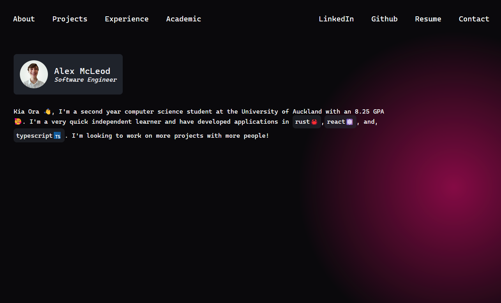

# Portfolio Website - Alex McLeod

Responsive portfolio website developed using a modern component based architecture with SolidJS and Vite as a build tool. Features various sections for, about me, projects, experience, and academic results, as well as links, and a contact page. Website, originally developed by @alexwillmcleod, can easily be forked and customised for anyone by re-using components and updating attributes for users.

Note: Contact page does not function.

## Screenshots

## Commands

run `yarn run dev` or `npm run dev` to start website in development mode. Add argument `--host` to run on your local network.

run `yarn run build` or `npm run build` to build the app with vite into the `/dist` folder.

Website can be deployed to any static hosting website.

Credit to @Microsoft for Cascadia Code font.
